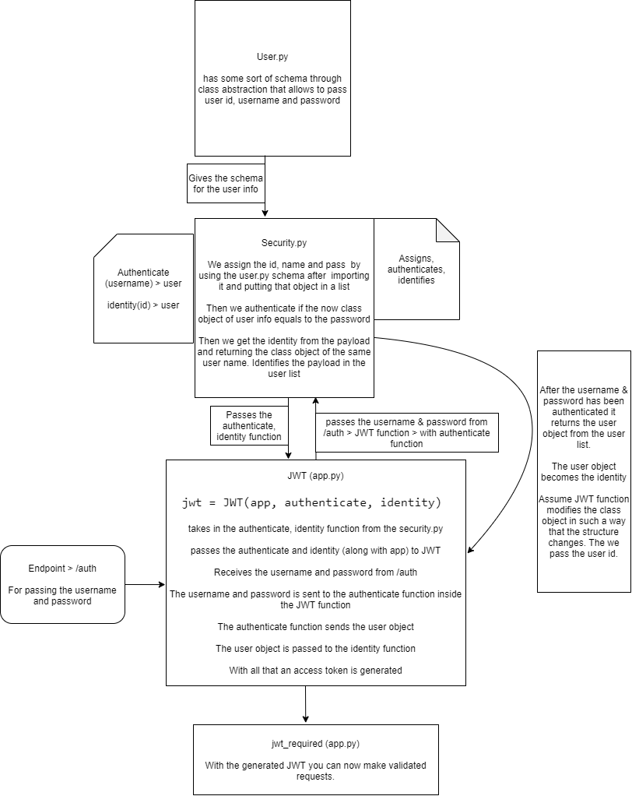

### Virtual Environment

```pip install virtualenv```

```virtualenv venv --python=python3.8```

```venv``` is the directory name

```python3.8``` is declaration of the python version to be used

To activate the ```venv``` >> ```./venv/Scripts/activate.bat```

To exit/deactivate the ```venv``` >> ```deactivate```

```pip freeze``` lets us see the modules in the venv

Preferably create a separate directory and work in it.

### Getting started

```python
from flask import Flask
from flask_restful import Resource, Api

app = Flask(__name__) # Flask module
api = Api(app) # We are calling the flask module's app into the flask-restful's import of API

# Student example

Class Student(Resource):
  def get(self, name):
    return {'student': name}

api.add_resource(Student, '/student/<string:name>') # We don't have decorators to declare the route; We are just GET

app.run(port=5000, debug=True)
```

### Test first design API using Postman 

Design the API endpoints in collections section and saving each request endpoints there. 

```PUT``` creates an entry if it doesn't exists or it will update it if it exists.

Request Type | Endpoint
---|---
GET | /items
GET | /items/<name>
POST | /items/<name>
DEL | /items/<name>
PUT | /items/<name>

### Creating item resources

```python
from flask import Flask, request
from flask_restful import Resource, Api

items = []

app = Flask(__name__) # Flask module
api = Api(app) # We are calling the flask module's app into the flask-restful's import of API

Class Item(Resource):
## FORMER CHAPTER!! 
  # def get(self, name):
  #   for item in items:
  #     if item['name'] == name:
  #       return item # we don't need to use jsonify as Flask-RESTful handles that for us
  #   return {'item': None}, 404  # It is healthy to return a JSON rather than direct None/null

  def get(self, name):
    item = next(filter(lambda x: x['name'] == name, items), None) # Just a filter with function to find the item from items
    # TIL next. when there is a single item in iterable (filter item, list item) "next" allows for the first item to be capture i.e. i[0]. Calling it again is i[1]
    # next(iterable, None) > allows for error capture index out of ... with None
    # In one statement we are either showing the item or None
    return {'item': item}, 200 if item else 404 # >> return {'item': item}, 200 if item is not None else 404
    # So either item 200 or None 404; the conditional deals with the the error code bit

## Taking the data in (POST) from URL params only; not with JSON (with Flask Request); FORMER CHAPTER
  # def post(self, name):
  #   item = {'name': name, 'price': 12} # we have set an arbitrary price; we just passing the data with the URL not with the body; We don't need Flask request for that
  #   items.append(item)
  #   return item, 201  # item is a dictionary; It is better to add the HTTP status code; 201 > Created; 202 > Accepted/Delaying creation; 200 > Ok (defualt)

  def post(self, name):
    # What to do when an item already exists
    if next(filter(lambda x: x['name']==name, items), None): # with if we are already testing truthy-falsy value
      return {'message': "An item with name '{}' already exists.".format(name)}, 400 # 400 Bad request
    
    # requires a JSON payload and appropriate content type header
    data = request.get_json(
      force=True # If you don't have content-type header it will forcefully convert to JSON; DO NOT USE IT!!
      silent=True # Silent doesn't give an error message when something goes wrong; it simply returns True
    )
    item = {'name': name, 'price': data['price']} # We are getting name from URL params; Price from JSON payload
    items.append(item)
    return item, 201

class ItemList(Resource):
  def get(self):
    return {'items': items}
  

api.add_resource(Item, '/item/<string:name>') # We don't have decorators to declare the route; We are just GET
api.add_resource(ItemList, '/items')

app.run(port=5000, debug=True)
```

### Authentication



install ```Flask-JWT```. ```JWT``` allows decrypting data.

two files -

1. ```app.py```
2. ```security.py```
3. ```user.py```


##### 2. security.py (FORMER CODE)

This is security section for authenticating stuff

```python

# this is your list of authenticated users

users = [
 {
   'id': 1,
   'username': 'bob',
   'password': 'asdf'
 } 
]

# repeated from previously
username_mapping = {
  'bob': {
   'id': 1,
   'username': 'bob',
   'password': 'asdf'
 } 
}

# repeated from previously

userid_mapping = {1: {
   'id': 1,
   'username': 'bob',
   'password': 'asdf'
 } 
}

# The reason we did this is because we can conveniently find the user based on username or userid.
# Allows for skipping iteration

def authenticate(username, password):
  user = username_mapping.get(username, None) # get dictionary method; if not found returns None
  if user and user.password == password:
  # validates the user if it is not None and checks password
    return user

def identity(payload):
  user_id = payload['identity'] # gets the userid from the payload
  return userid_mapping.get(user_id, None) # checks if the payload userid exists in the userid_mapping
```

##### 3. user.py

This is going to allow you to use class based objects for storing user data rather then storing them in a dictionary in the security.py

```python
class User:
  def __init__(self, _id, username, password):
    self.id = _id # "id" is a python keyword so we added the "_"; We could have used userid too
    self.username =  username
    self.password =  password
```


##### 2. security.py

```python

from werkzeug.security import safe_str_cmp
# allows you to compare strings across all encoding standards (utf, unicode, ascii...)
# we will be using it in the authenticate function
from user import User
# user.py > class User

users = [
  User(1, 'bob', 'asdf')
  # User (_id, username, password)
]

# dictionary comprehension that has username as key & dictionary itself as value
username_mapping = {u.username: u for u in users}
userid_mapping = {u.id: u for u in users}


def authenticate(username, password):
  user = username_mapping.get(username, None)
  if user and safe_str_cmp(user.password, password)
    return user

def identity(payload):
  user_id = payload['identity']
  return userid_mapping.get(user_id, None)
```

##### 1. app.py

```python
from flask import Flask, request
from flask_restful import Resource, Api
from flask_jwt import JWT
from flask_jwt import jwt_required
# we made request using username and password; And we got a JWT confirming our existence in the user object
# to validate every future request we make we are going to need send something with that request
# to show we are the validated user

from security import authenticate, identity

app = Flask(__name__)
app.secret_key = 'use a secret key here'
api = Api(app)
jwt = JWT(app, authenticate, identity) #/auth
# we are using the authenticate and the identity function from the security app
# this creates a new endpoint called "/auth"
# we can pass the username and password through that endpoint
# this password and username is sent over to authenticate function
# the authenticate function returns the user object
# authenticate generates the JWT
# authenticate deals with /auth endpoint only
# the returned user object helps to generate the JWT
# for every other requests we are using the identity function
# with every request "payload" there is the JWT
# and the "payload" of request is first validated by the identitfy function
# the identity function validates requests with the JWT to make sure it is the same user making the requests
# identity function ensures further requests with validated JWT 


items = []
Class Item(Resource):
  @jwt_required() # Means that we need have the JWT (or be authenticated) to make the get request
  def get(self, name):
    item = next(filter(lambda x: x['name'] == name, items), None)
    return {'item': item}, 200 if item else 404
  
  def post(self, name):
    if next(filter(lambda x: x['name']==name, items), None):
      return {'message': "An item with name '{}' already exists.".format(name)}, 400
    
    data = request.get_json()
    item = {'name': name, 'price': data['price']}
    items.append(item)
    return item, 201

class ItemList(Resource):
  def get(self):
    return {'items': items}
  

api.add_resource(Item, '/item/<string:name>')
api.add_resource(ItemList, '/items')

app.run(port=5000, debug=True)
```


##### Postman sending credentials on /auth

go to ```/auth```. Select ```POST```

Headers 

Key | Value
---|---
Content-Type | application/json

send body -
```json
{
  "username": "bob",
  "password": "asdf"
}
```

Needs to match what we have in security.py

Now in the response you will see the ```JWT``` or the ```access token```

Now copy the access token

Now make a GET request to ```item/something``` and You will not see that because you are not authenticated. 401 is unauthorized.

Now make the request with - 

Key | Value
---|---
Authorization | JWT \*access token\*

### Delete & Put

##### app.py

```python
from flask import Flask, request
from flask_restful import Resource, Api
from flask_jwt import JWT, jwt_required

from security import authenticate, identity

app = Flask(__name__)
app.secret_key = 'use a secret key here'
api = Api(app)
jwt = JWT(app, authenticate, identity)

items = []
Class Item(Resource):
  @jwt_required()
  def get(self, name):
    item = next(filter(lambda x: x['name'] == name, items), None)
    return {'item': item}, 200 if item else 404
  
  def post(self, name):
    if next(filter(lambda x: x['name']==name, items), None):
      return {'message': "An item with name '{}' already exists.".format(name)}, 400
    
    data = request.get_json()
    item = {'name': name, 'price': data['price']}
    items.append(item)
    return item, 201

  def delete(self, name):
     global items # We need it here. Or we are going to be calling function scope problems.
     items = list(filter(lambda x: x['name']==name, items))
     return {'message': 'item deleted'}
  
  def put(self, name):
    # put updates or creates
    data = request.get_json()
    item = next(filter(lambda x: x['name'] == name, items), None)
    if item is None:
      item = {'name': name, price: data['price']}
      items.append(item)
    else:
      item.update(data)
    return item

class ItemList(Resource):
  def get(self):
    return {'items': items}
  

api.add_resource(Item, '/item/<string:name>')
api.add_resource(ItemList, '/items')

app.run(port=5000, debug=True)
```

### Advanced Request Parsing

Allows for selectively choosing fields in the request level using ```reqparse```. Helps to secure data too.

##### app.py

```python
from flask import Flask, request
from flask_restful import Resource, Api
from flask_jwt import JWT, jwt_required
from flask_restful import reqparse
# For request parsing argument, type enforcement....; we are using it in the PUT function

from security import authenticate, identity

app = Flask(__name__)
app.secret_key = 'use a secret key here'
api = Api(app)
jwt = JWT(app, authenticate, identity)

items = []
Class Item(Resource):
  @jwt_required()
  def get(self, name):
    item = next(filter(lambda x: x['name'] == name, items), None)
    return {'item': item}, 200 if item else 404
  
  def post(self, name):
    if next(filter(lambda x: x['name']==name, items), None):
      return {'message': "An item with name '{}' already exists.".format(name)}, 400
    
    data = request.get_json()
    item = {'name': name, 'price': data['price']}
    items.append(item)
    return item, 201

  def delete(self, name):
     global items
     items = list(filter(lambda x: x['name']==name, items))
     return {'message': 'item deleted'}
  
  def put(self, name):
    parser =  reqparse.RequestParser()
    parser.add_argument(
      'price', # the field will get passed only; nothing else will.
      type=float,
      required=True,
      help="this field cannot be left empty"
    )
    # data = request.get_json()
    data = parser.parse_args()

    item = next(filter(lambda x: x['name'] == name, items), None)
    if item is None:
      item = {'name': name, price: data['price']}
      items.append(item)
    else:
      item.update(data)
    return item

class ItemList(Resource):
  def get(self):
    return {'items': items}
  

api.add_resource(Item, '/item/<string:name>')
api.add_resource(ItemList, '/items')

app.run(port=5000, debug=True)
```


### Optimizing the code

##### app.py

```python
from flask import Flask, request
from flask_restful import Resource, Api
from flask_jwt import JWT, jwt_required
from flask_restful import reqparse
# For request parsing argument, type enforcement....; we are using it in the PUT function

from security import authenticate, identity

app = Flask(__name__)
app.secret_key = 'use a secret key here'
api = Api(app)
jwt = JWT(app, authenticate, identity)

items = []
Class Item(Resource):
  # As we are going to use the reqparse across request methods
  # we want to make sure everyone has access to it
  # we need to put it in here rather than adding it to every function
  # this is not a "self" object rather a "Item" object
  parser =  reqparse.RequestParser()
  parser.add_argument(
      'price', # the field will get passed only; nothing else will.
      type=float,
      required=True,
      help="this field cannot be left empty"
  )

  @jwt_required()
  def get(self, name):
    item = next(filter(lambda x: x['name'] == name, items), None)
    return {'item': item}, 200 if item else 404
  
  def post(self, name):
    if next(filter(lambda x: x['name']==name, items), None):
      return {'message': "An item with name '{}' already exists.".format(name)}, 400
    
    data = Item.parser.parse_args() # We put it here because we first deal with the validation then we deal with the request
    item = {'name': name, 'price': data['price']}
    items.append(item)
    return item, 201

  def delete(self, name):
     global items
     items = list(filter(lambda x: x['name']==name, items))
     return {'message': 'item deleted'}
  
  def put(self, name):
    item = next(filter(lambda x: x['name'] == name, items), None)
    data = parser.parse_args()

    if item is None:
      item = {'name': name, price: data['price']}
      items.append(item)
    else:
      item.update(data)
    return item

class ItemList(Resource):
  def get(self):
    return {'items': items}
  

api.add_resource(Item, '/item/<string:name>')
api.add_resource(ItemList, '/items')

app.run(port=5000, debug=True)
```