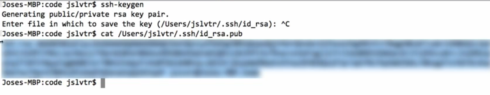

### Intro

Version control means a method of making snapshots of changes you make.

If there is errors you can rollback. And for collaboration you can merge their work.

Used for collaboration and error control.

### What is a Repo?

Git

- is a set of layers
- each layer has a function
- you move files between those layers
- these layers provides error controls, redundancy and other things

#### Layers of git


1. The filesystem: This is the entire OS file system; Not part of the Git environment
2. Then we have the directory where we have a git folder initialized.
3. Even though the git initialized in the directory changes to file are not tracked.
4. You need to tell git to track the changes on files. You tell git that track changes in the next snapshot.
5. If it is only one file you add that file in the staging area. You add the files on the next commit.
6. Snapshot-ing the files means committing them.
7. You commit the files in the local repository. And this will create snapshot.
8. As you make more changes and make subsequent commits this will create a history of all the changes you made.
9. Now to secure the history of changes and the files you push them all to the cloud.

#### The git workflow part-1

```git init``` to initialize a git repository.

```git status``` shows the status of the repo.

```touch app.py``` create the app.py file.

```git add app.py``` tells git move this file to the staging area.

```git rm --cached app.py``` to remove the app.py from the staging stage.

```git commit -m "Created a simple app"``` Commiting to git repo. It is best to have descriptive commit messages.


This shows the commit code that will come in handy.

#### The git workflow part-2

```git remote add origin repo-url``` defines remote origin repo

```git push``` looks for remote origin repo then pushes.

But someimes it will fail because the github repo (remote origin) may not have the master branch. So when we push local master branch to an empty repo with branches git gets confused about where to host the repo.

so, we need to set a master branch there.

```git push --set-upstream origin master```

Remote repo >> Origin. After you push, the central repo or the core repo becomes the Github repo. The local repo is an extension of the Origin repo (remote repo).

```git pull``` downloads the changes or other peoples code from the remote repo (origin).

But there is a catch. If you have local code on your repo, downloading the origin repo where changes are made from another device will create some problems.

#### Using SSH keys for Security

SSH Keys is a way to encrypt information. Whenever you generate an SSH key, two keys are generated.

1. Public key: Anyone with that key can decrypt that information.
2. Private key: With the private key you can encrypt.

So, you share that public key with services so they can decrypt the data.

So how it works:

1. You have data encrypted with your private key.
2. You send the data to github who already has a public key.
3. When they can decrypt the data with that public key, Github knows that that data is coming from you.
4. No other public key can decrypt that data

With SSH allows you to skip using username and passwords. So, you need to generate the SSH key locally.

To do that, ```ssh-keygen``` then save it either in the default directory or a custom directory.



Then put in the passphrase that you need to use everytime you use the key.

 Now to share Public SSH key. Out put the directory resource where the ssh is stored and add ".pub" at the end.

Copy all of the output.

Go to Gihub > Profile > Edit > SSH and GPG Keys > Add a new SSH key > Give a title and the save the SSH key.


